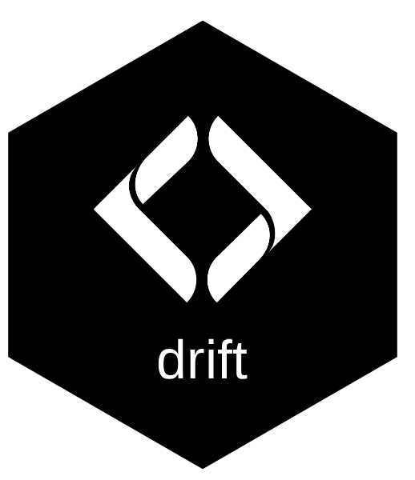

# drift 

Track land cover change in riparian and floodplain areas using free satellite imagery.

drift fetches classified rasters from STAC catalogs (Esri IO LULC, ESA WorldCover, or your own COGs), applies class labels and colors, and summarizes area change over time — ready for reports, maps, and plots.

## Why

Monitoring riparian vegetation loss matters for fish habitat, water quality, and restoration planning. Satellite land cover products are free and global, but wrangling multi-year STAC data into usable summaries takes boilerplate. drift handles the pipeline so you can focus on the analysis.

## Install

```r
pak::pak("NewGraphEnvironment/drift")
```

## Quick start

```r
library(drift)

# Fetch IO LULC for your AOI
rasters <- dft_stac_fetch(aoi, source = "io-lulc", years = c(2017, 2020, 2023))

# Classify with standard labels and colors
classified <- dft_rast_classify(rasters, source = "io-lulc")

# Summarize area by class and year
summary <- dft_rast_summarize(classified, unit = "ha")
```

## Related packages

[flooded](https://github.com/NewGraphEnvironment/flooded) delineates floodplain extents from DEMs and stream networks — use it to generate the AOI polygons that drift analyzes for land cover change.

## Documentation

Full reference and a worked example (Neexdzii Kwa floodplain, 2017-2023) at the [pkgdown site](https://www.newgraphenvironment.com/drift/).
