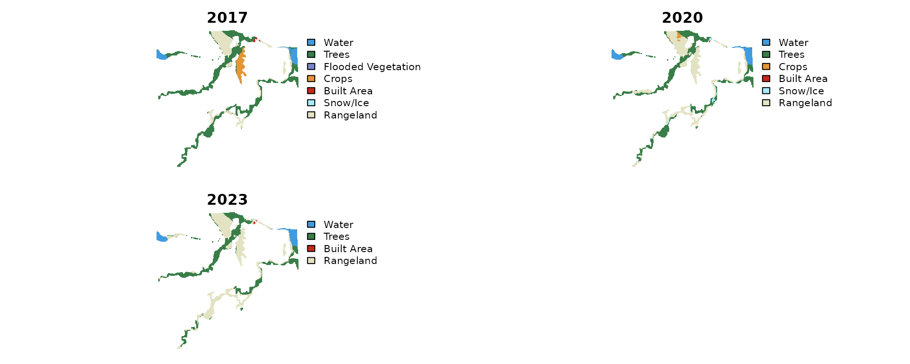
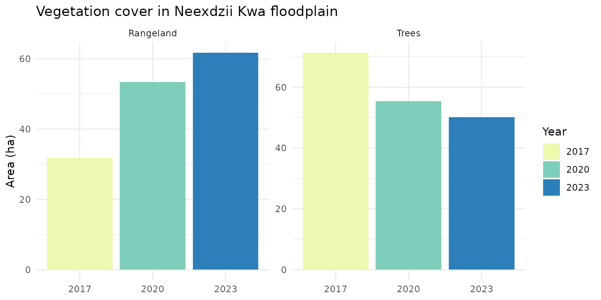
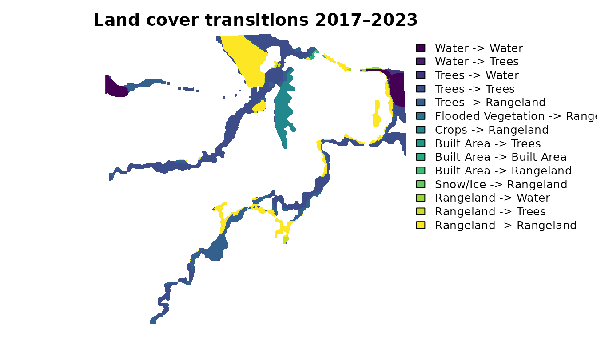

# Land Cover Change — Neexdzii Kwa

This vignette demonstrates the drift pipeline using a small floodplain
reach on Neexdzii Kwa (Upper Bulkley River) in northern BC. We compare
Esri IO LULC land cover across 2017, 2020, and 2023 to track vegetation
and land use change in the riparian zone.

The AOI polygon was delineated using the
[flooded](https://github.com/NewGraphEnvironment/flooded) package, which
identifies floodplain extents from DEMs and stream networks.

The example data ships with the package — no STAC queries or database
connections needed.

## Load Data

``` r
library(drift)
library(terra)
#> terra 1.8.93
library(sf)
#> Linking to GEOS 3.12.1, GDAL 3.8.4, PROJ 9.4.0; sf_use_s2() is TRUE

# AOI polygon (floodplain delineated via flooded package)
aoi <- sf::st_read(
  system.file("extdata", "example_aoi.gpkg", package = "drift"),
  quiet = TRUE
)

# IO LULC rasters for 3 years
years <- c(2017, 2020, 2023)
rasters <- lapply(years, function(yr) {
  terra::rast(system.file("extdata", paste0("example_", yr, ".tif"),
                          package = "drift"))
})
names(rasters) <- years
```

## Classify

Apply IO LULC class names and colors from the shipped class table.

``` r
classified <- dft_rast_classify(rasters, source = "io-lulc")

# Check factor levels
terra::levels(classified[["2020"]])[[1]]
#>   id class_name
#> 1  1      Water
#> 2  2      Trees
#> 3  5      Crops
#> 4  7 Built Area
#> 5  9   Snow/Ice
#> 6 11  Rangeland
```

## Plot Classified Rasters

``` r
# Stack into a single multi-layer SpatRaster for panel plot
stacked <- terra::rast(classified)
names(stacked) <- names(classified)
terra::plot(stacked, axes = FALSE, mar = c(1, 1, 2, 1))
```



## Summarize

Compute area by class for each year.

``` r
summary_tbl <- dft_rast_summarize(classified, source = "io-lulc", unit = "ha")
summary_tbl
#> # A tibble: 17 × 7
#>    year   code class_name         color   n_cells  area   pct
#>    <chr> <int> <chr>              <chr>     <int> <dbl> <dbl>
#>  1 2017      1 Water              #419bdf     941  9.41  7.64
#>  2 2017      2 Trees              #397d49    7127 71.3  57.9 
#>  3 2017      4 Flooded Vegetation #7a87c6       2  0.02  0.02
#>  4 2017      5 Crops              #e49635     998  9.98  8.11
#>  5 2017      7 Built Area         #c4281b      55  0.55  0.45
#>  6 2017      9 Snow/Ice           #a8ebff       2  0.02  0.02
#>  7 2017     11 Rangeland          #e3e2c3    3186 31.9  25.9 
#>  8 2020      1 Water              #419bdf    1089 10.9   8.85
#>  9 2020      2 Trees              #397d49    5542 55.4  45.0 
#> 10 2020      5 Crops              #e49635     147  1.47  1.19
#> 11 2020      7 Built Area         #c4281b      10  0.1   0.08
#> 12 2020      9 Snow/Ice           #a8ebff     185  1.85  1.5 
#> 13 2020     11 Rangeland          #e3e2c3    5338 53.4  43.4 
#> 14 2023      1 Water              #419bdf    1111 11.1   9.02
#> 15 2023      2 Trees              #397d49    5007 50.1  40.7 
#> 16 2023      7 Built Area         #c4281b      26  0.26  0.21
#> 17 2023     11 Rangeland          #e3e2c3    6167 61.7  50.1
```

## Area Change Table

``` r
library(dplyr)
#> 
#> Attaching package: 'dplyr'
#> The following objects are masked from 'package:terra':
#> 
#>     intersect, union
#> The following objects are masked from 'package:stats':
#> 
#>     filter, lag
#> The following objects are masked from 'package:base':
#> 
#>     intersect, setdiff, setequal, union
library(tidyr)
#> 
#> Attaching package: 'tidyr'
#> The following object is masked from 'package:terra':
#> 
#>     extract

change <- summary_tbl |>
  dplyr::select(year, class_name, area) |>
  tidyr::pivot_wider(names_from = year, values_from = area, values_fill = list(area = 0)) |>
  dplyr::mutate(
    change = `2023` - `2017`,
    pct_change = round(change / `2017` * 100, 1)
  ) |>
  dplyr::arrange(dplyr::desc(abs(change)))

knitr::kable(change, digits = 2, caption = "Land cover change 2017–2023 (ha)")
```

| class_name         |  2017 |  2020 |  2023 | change | pct_change |
|:-------------------|------:|------:|------:|-------:|-----------:|
| Rangeland          | 31.86 | 53.38 | 61.67 |  29.81 |       93.6 |
| Trees              | 71.27 | 55.42 | 50.07 | -21.20 |      -29.7 |
| Crops              |  9.98 |  1.47 |  0.00 |  -9.98 |     -100.0 |
| Water              |  9.41 | 10.89 | 11.11 |   1.70 |       18.1 |
| Built Area         |  0.55 |  0.10 |  0.26 |  -0.29 |      -52.7 |
| Flooded Vegetation |  0.02 |  0.00 |  0.00 |  -0.02 |     -100.0 |
| Snow/Ice           |  0.02 |  1.85 |  0.00 |  -0.02 |     -100.0 |

Land cover change 2017–2023 (ha)

## Vegetation Change

Bar plot of the dominant vegetation classes over time. Trees and
Rangeland show the clearest signal — tree cover declining while
rangeland expands.

``` r
library(ggplot2)

summary_tbl |>
  dplyr::filter(class_name %in% c("Trees", "Rangeland")) |>
  ggplot(aes(x = year, y = area, fill = year)) +
  geom_col() +
  facet_wrap(~class_name, scales = "free_y") +
  scale_fill_brewer(palette = "YlGnBu") +
  labs(y = "Area (ha)", x = NULL, fill = "Year",
       title = "Vegetation cover in Neexdzii Kwa floodplain") +
  theme_minimal()
```



## Transition Detection

Identify exactly which pixels changed from one class to another between
time steps.
[`dft_rast_transition()`](https://newgraphenvironment.github.io/drift/reference/dft_rast_transition.md)
compares two rasters cell-by-cell and returns a transition raster plus a
summary table.

``` r
result <- dft_rast_transition(classified, from = "2017", to = "2023")
knitr::kable(result$summary, digits = 2, caption = "All land cover transitions 2017–2023")
```

| from_class         | to_class   | n_cells |  area |   pct |
|:-------------------|:-----------|--------:|------:|------:|
| Trees              | Trees      |    4918 | 49.18 | 39.95 |
| Rangeland          | Rangeland  |    3026 | 30.26 | 24.58 |
| Trees              | Rangeland  |    2111 | 21.11 | 17.15 |
| Crops              | Rangeland  |     998 |  9.98 |  8.11 |
| Water              | Water      |     938 |  9.38 |  7.62 |
| Trees              | Water      |      98 |  0.98 |  0.80 |
| Rangeland          | Trees      |      85 |  0.85 |  0.69 |
| Rangeland          | Water      |      75 |  0.75 |  0.61 |
| Built Area         | Rangeland  |      28 |  0.28 |  0.23 |
| Built Area         | Built Area |      26 |  0.26 |  0.21 |
| Water              | Trees      |       3 |  0.03 |  0.02 |
| Flooded Vegetation | Rangeland  |       2 |  0.02 |  0.02 |
| Snow/Ice           | Rangeland  |       2 |  0.02 |  0.02 |
| Built Area         | Trees      |       1 |  0.01 |  0.01 |

All land cover transitions 2017–2023

### Filter to Tree Loss

Focus on the pixels where Trees in 2017 became agriculture-related
classes by 2023. At 10 m resolution, Crops, Rangeland, and Bare Ground
can represent different phases of the same land use depending on
satellite overpass timing.

``` r
tree_loss <- dft_rast_transition(classified, from = "2017", to = "2023",
                                  from_class = "Trees",
                                  to_class = c("Crops", "Rangeland", "Bare Ground"))
tree_loss$summary
#> # A tibble: 1 × 5
#>   from_class to_class  n_cells  area   pct
#>   <chr>      <chr>       <int> <dbl> <dbl>
#> 1 Trees      Rangeland    2111  21.1   100
```

### Plot Transition Raster

``` r
terra::plot(result$raster, main = "Land cover transitions 2017–2023",
            axes = FALSE, mar = c(1, 1, 2, 6))
```



## Interactive Map

Toggle between time periods to see how land cover changed across the
floodplain.

``` r
dft_map_interactive(classified, aoi = aoi)
```

### Transition Map

Each transition from Trees is shown as a separate toggleable layer,
making it easy to ground-truth specific change types against satellite
basemaps.

``` r
# All transitions from Trees (excluding stable Trees->Trees)
all_from_trees <- dft_rast_transition(classified, from = "2017", to = "2023",
                                       from_class = "Trees")
to_classes <- all_from_trees$summary$to_class
to_classes <- to_classes[to_classes != "Trees"]

# Color palette for transition types
trans_colors <- c("Rangeland" = "#e74c3c", "Crops" = "#e67e22",
                  "Bare Ground" = "#8e44ad", "Water" = "#3498db",
                  "Built Area" = "#2c3e50", "Flooded Vegetation" = "#1abc9c")

map <- leaflet::leaflet() |>
  leaflet::addProviderTiles("CartoDB.Positron", group = "Light") |>
  leaflet::addProviderTiles("Esri.WorldImagery", group = "Esri Satellite") |>
  leaflet::addTiles("https://mt1.google.com/vt/lyrs=s&x={x}&y={y}&z={z}",
                     group = "Google Satellite")

overlay_groups <- c()

for (tc in to_classes) {
  trans <- dft_rast_transition(classified, from = "2017", to = "2023",
                                from_class = "Trees", to_class = tc)
  if (nrow(trans$summary) == 0) next

  label <- paste0("Trees -> ", tc)
  col <- if (tc %in% names(trans_colors)) trans_colors[[tc]] else "#999999"
  r_proj <- terra::project(trans$raster, "EPSG:4326")
  map <- leaflet::addRasterImage(map, r_proj, group = label,
                                  colors = col, project = FALSE)
  overlay_groups <- c(overlay_groups, label)
}

# AOI outline
map <- leaflet::addPolygons(map, data = sf::st_transform(aoi, 4326),
                             fill = FALSE, color = "red", weight = 2, group = "AOI")
overlay_groups <- c(overlay_groups, "AOI")

# Legend
legend_colors <- vapply(to_classes, function(tc) {
  if (tc %in% names(trans_colors)) trans_colors[[tc]] else "#999999"
}, character(1))
map <- leaflet::addLegend(map, position = "bottomright",
                           colors = legend_colors,
                           labels = paste0("Trees -> ", to_classes),
                           title = "Tree Loss 2017-2023", opacity = 1)

# Center and controls
ext <- terra::ext(terra::project(classified[["2017"]], "EPSG:4326"))
map <- leaflet::setView(map, lng = mean(c(ext[1], ext[2])),
                         lat = mean(c(ext[3], ext[4])), zoom = 14)
map <- leaflet::addLayersControl(map,
        baseGroups = c("Light", "Esri Satellite", "Google Satellite"),
        overlayGroups = overlay_groups,
        options = leaflet::layersControlOptions(collapsed = FALSE))
map <- leaflet.extras::addFullscreenControl(map)
map
```
